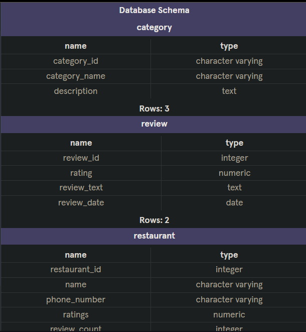
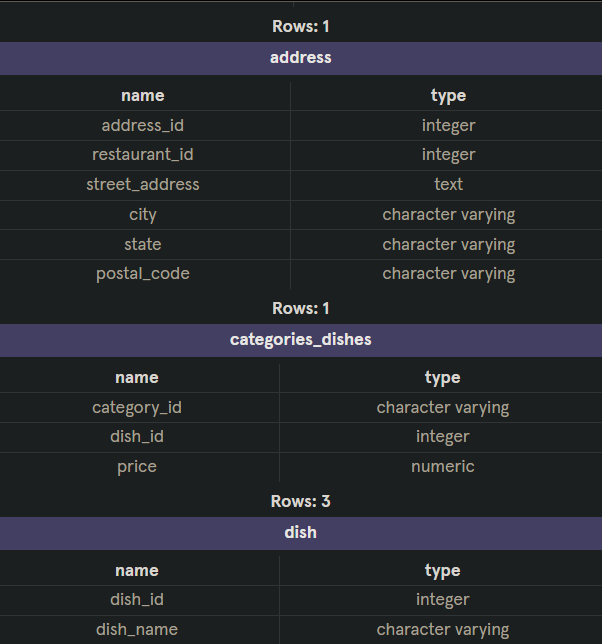
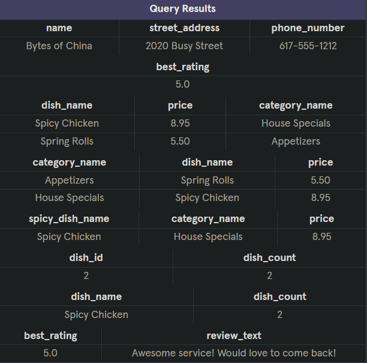

# Bytes of China Database Schema

## Overview

This repository contains the PostgreSQL database schema for "Bytes of China", a Chinese restaurant located in Chinatown. The schema is designed to manage the restaurant’s menu, including categories and dishes, as well as customer reviews. It defines the relationships between different entities such as restaurant details, menu items, and reviews.

## Prerequisites

- PostgreSQL must be installed on your system.

## Project Structure

- `schema.sql`: SQL script that creates the database schema, including tables, primary keys, and foreign keys.
- `sample_data.sql`: SQL script to populate the database with sample data for restaurant details, categories, dishes, and reviews.
- `queries.sql`: SQL queries to demonstrate basic database functionality and how to retrieve data from the schema.
- `README.md`: Project description and setup instructions.

## Database Schema



## Query Results


### Tables:

1. **restaurant**: Contains the basic details of the restaurant.
  - `restaurant_id`: Primary key.
  - `name`: Restaurant name.
  - `phone_number`: Contact number.
  - `ratings`: Average ratings.
  - `review_count`: Number of reviews.

2. **address**: Stores the address details of the restaurant.
  - `address_id`: Primary key.
  - `restaurant_id`: Foreign key referencing `restaurant`.
  - `street_address`: Address of the restaurant.
  - `city`, `state`, `postal_code`: Location details.

3. **category**: Defines menu categories (e.g., Appetizers, House Specials).
  - `category_id`: Primary key (two-character identifier).
  - `category_name`: Name of the category.
  - `description`: Optional description (e.g., hours of availability).

4. **dish**: Contains details of individual dishes.
  - `dish_id`: Primary key.
  - `dish_name`: Name of the dish.
  - `price`: Price of the dish.
  - `description`: Brief description of the dish.
  - `is_spicy`: Boolean indicator for spicy dishes.
  - `category_id`: Foreign key referencing `category`.

5. **categories_dishes**: Cross-reference table for the many-to-many relationship between categories and dishes.
  - `category_id`: Foreign key referencing `category`.
  - `dish_id`: Foreign key referencing `dish`.
  - `price`: Price of the dish for the respective category.

6. **review**: Stores customer reviews.
  - `review_id`: Primary key.
  - `rating`: Customer rating.
  - `review_text`: The review comment.
  - `review_date`: Date of the review.

## Setup Instructions

### Step 1: Clone the Repository

```bash
git clone https://github.com/kulembetov/bytes-of-china-db.git
cd bytes-of-china-db
```

### Step 2: Create the Database

```
createdb bytes_of_china
```

## Step 3: Import the Schema

```
psql -d bytes_of_china -f schema.sql

```

### Step 4: Insert Sample Data

```
psql -d bytes_of_china -f sample_data.sql
```

### Step 5: Run Example Queries

```
createdb bytes_of_china
```
